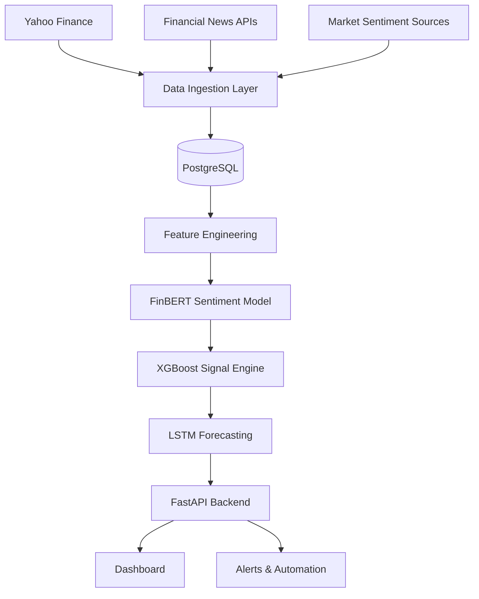

# 🚀 Finzer

<div align="center">


</div>

---

## 🎯 Vision

Finzer is an end-to-end Market Intelligence Platform designed to learn and implement:

* Machine Learning
* Data Engineering
* Automation
* MLOps
* Quantitative Analysis
* Backend Engineering
* System Design

Instead of building isolated tutorials, Finzer combines everything into a single evolving production-style system.

The goal is simple:

> Transform raw market data and financial news into structured intelligence using automation and machine learning.

---

# 🏗 Architecture



---

# ⚙ Current Progress

## Phase 1 — Foundation ✅

* [x] Python Environment Setup
* [x] Git Repository Initialization
* [x] PostgreSQL Installation
* [x] SQLAlchemy Setup
* [x] Database Connection Layer
* [x] PriceBar Data Model
* [x] NewsArticle Data Model
* [x] Historical Price Ingestion
* [x] Financial News Ingestion

---

## Phase 2 — Machine Learning 🚧

* [ ] FinBERT Sentiment Analysis
* [ ] Sentiment Storage Pipeline
* [ ] Feature Engineering
* [ ] Training Dataset Creation
* [ ] XGBoost Signal Classifier

---

## Phase 3 — Forecasting 📌

* [ ] LSTM Price Prediction
* [ ] Model Evaluation
* [ ] Hyperparameter Tuning
* [ ] Prediction Tracking

---

## Phase 4 — Automation 📌

* [ ] Scheduled Data Collection
* [ ] Automated Retraining
* [ ] Signal Generation Jobs
* [ ] Telegram Alerts
* [ ] Email Notifications

---

## Phase 5 — Frontend 📌

* [ ] FastAPI REST API
* [ ] Next.js Dashboard
* [ ] Signal Feed
* [ ] Live Charts
* [ ] Backtesting Interface

---

# 🧠 Machine Learning Roadmap

## FinBERT

Financial NLP model used to determine:

```text
Bullish
Bearish
Neutral
```

Example:

Headline:
Apple Reports Record Revenue Growth

Output:

Bullish
Confidence: 94%
Score: +0.87

````

---

## XGBoost

Inputs:

- Sentiment Score
- Volume
- RSI
- Moving Averages
- MACD
- Price Momentum

Output:

```text
BUY
SELL
HOLD
````

---

## LSTM

Sequence model trained on historical market data.

Predictions:

```text
Future Price
Trend Direction
Confidence Interval
```

---

# 🗄 Database Schema

## price_bars

```text
id
symbol
timestamp
open
high
low
close
volume
```

## news_articles

```text
id
symbol
headline
source
url
published_at
created_at
sentiment_score
```

---

# 📂 Project Structure

```bash
Finzer
│
├── backend
│   ├── api
│   ├── automation
│   ├── db
│   ├── ingestion
│   └── ml
│
├── frontend
│
├── tests
│
├── .env
├── requirements.txt
├── README.md
└── venv
```

---

# 🔥 Why Finzer?

Most beginner ML projects stop at:

```python
model.fit(X_train, y_train)
```

Finzer goes much further.

It focuses on understanding:

* Where data comes from
* How data is stored
* How features are engineered
* How models are trained
* How models are deployed
* How systems are automated
* How production ML actually works

Every component is built from scratch and understood line by line.

No black boxes.

No tutorial copying.

No vibe coding.

---

# 🚀 Long-Term Goal

Build a production-grade market intelligence platform capable of:

* Collecting financial data automatically
* Understanding market sentiment
* Training predictive models
* Generating trading signals
* Serving predictions through APIs
* Visualizing insights in real time

---

<div align="center">

### Built to Learn.

### Built to Scale.

### Built to Automate.

⭐ Star the repo if you follow the journey.

</div>
